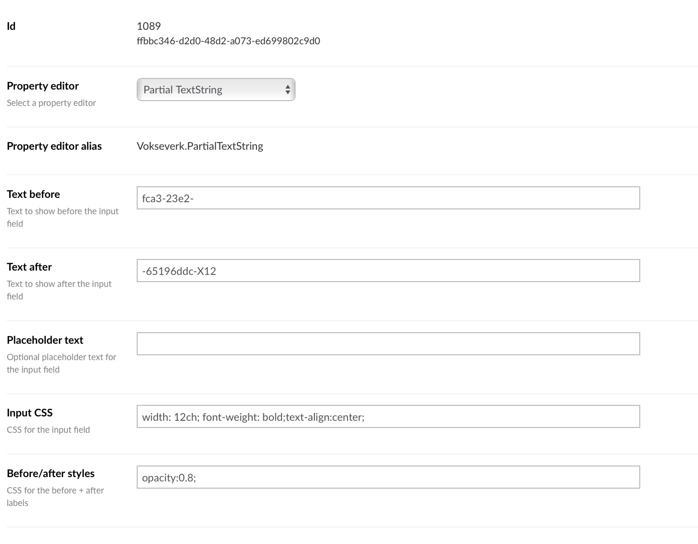

# Partial TextString for Umbraco

This is a small extension to a standard "Textbox" editor, that allows
you to specify a prefix and/or suffix string to show alongside the editor.

Sometimes that's much better than trying to use the description to explain
that you should only type in e.g. the username for an email account or similar.

## Requirements

This package should work in both Umbraco 7 and Umbraco 8.

## Screenshots

### In use on a document

### Data Type configuration

## Developing & Building

On macOS you can run the `build.sh` script from the terminal, which will
build a ZIP file in the `dist` folder that is installable from
Umbraco 8's _Packages_ section or Umbraco 7's _Developer > Packages_ section.

The build script versions the files so it's easier to test the package inside
an Umbraco installation by uninstalling the existing version and then
installing a new build. Existing data-types keep their data as long as their
alias and/or storage type isn't changed.

To update the version number, increment the `packageVersion` entity in the
`src/package.ent` file.
